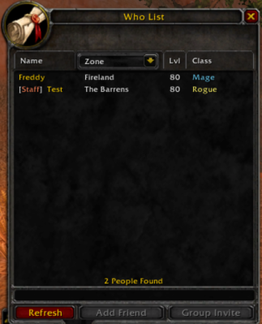

# Latest AzerothCore Revision 2023/10/08 MiscHandler.cpp File


## WhoList_Staff
Azerothcore Edit that show Staff rank in Who List
Credits to me [Hypnos] mithras_0 /  [Revision - noisiver] Revision#2262 (Help on the script) / [Trojan] Trojan#1312 (Help & Fix on the script) & [Dandi] Dandi#2828 (Help & Fix on the script + Making it to work with the final touch)

****Last credits to the old Owner script idea from 2013 "Wise" on TrinityCore****

```
https://www.mmopro.org/archive/index.php/t-20022.html?s=15ac4afca3652733d91263db694e3c2a&fbclid=IwAR2VyHRFWFit5VSHKydMyAPztjMuijQ7Z9nKqx3L9v4qSPPQe7JV88CQEVo
```


Just Download the "MiscHandler.cpp" & put it in your Source Folder
...src\server\game\Handlers

 or

 ****Copy the Code & replace it at line 398 in "MiscHandler.cpp".*****
 
****Remove the line 398 by Pasting the code on it****

Line 398 in MiscHandler.cpp

****data << target.GetPlayerName();                   // player name**** 


****Code to Paste On line 398****

```
std::string playerName = ""; //temp storage

//definition of playerName depending on the (player/GM)'s rank
if (target.GetSecurity() >= 1) //if the rank is 1 or above
    playerName = "|cffFFFFFF[|r|cffFA8258Staff|cffffffff]|r  " + target.GetPlayerName();
else
    playerName = target.GetPlayerName();

//data << target.GetPlayerName();                 // player name - commented out to be replaced with the new playerName
data << playerName;                               //player name - with Staff indicator
```

& Then it should show like that ingame 

